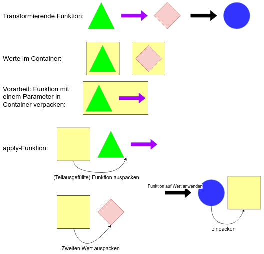

### Problem: Funktion mit mehreren eingepackten Parametern
```fsharp
let add a b = a + b

let onlyPositive i =
  if i > 0 then
    Some i
  else
    None

let addTwoNumbers a b =
  let positiveA = onlyPositive a
  let positiveB = onlyPositive b
  // passt nicht, 2x int erwartet, aber 2x int option übergeben
  let sum = add positiveA positiveB

  // für zwei in F# bereits vordefiniert:
  let sum = Option.map2 add positiveA positiveB

  // aber was, wenn man mehr Parameter hat?

```

---

### Applicative



---

### Applicative
- Container mit "apply" Funktion (die bestimmten Regeln folgt): Applicative
- Bezeichnung in der FP-Welt: **Applicative Functor**
- 
```fsharp
  apply: AF (a -> b) -> AF a -> AF b
```
- Andere Bezeichnungen für "apply": ap, <*>

---

### Funktion mit mehreren Parametern

```fsharp
let sum a b c = a + b + c

let onlyPositive i =
    if i > 0 then Some i
    else None

let addNumbers a b c =
    let positiveA = onlyPositive a
    let positiveB = onlyPositive b
    let positiveC = onlyPositive c

    // sum ist vom Typ: (int -> int -> int -> int)
    // jede Zeile füllt ein Argument mehr aus
    // (Partial Application dank Currying)
    let (sum' : (int -> int -> int) option) = Option.map sum positiveA
    let (sum'' : (int -> int) option) = Option.apply sum' positiveB
    let (sum''' : (int) option) = Option.apply sum'' positiveC
```
