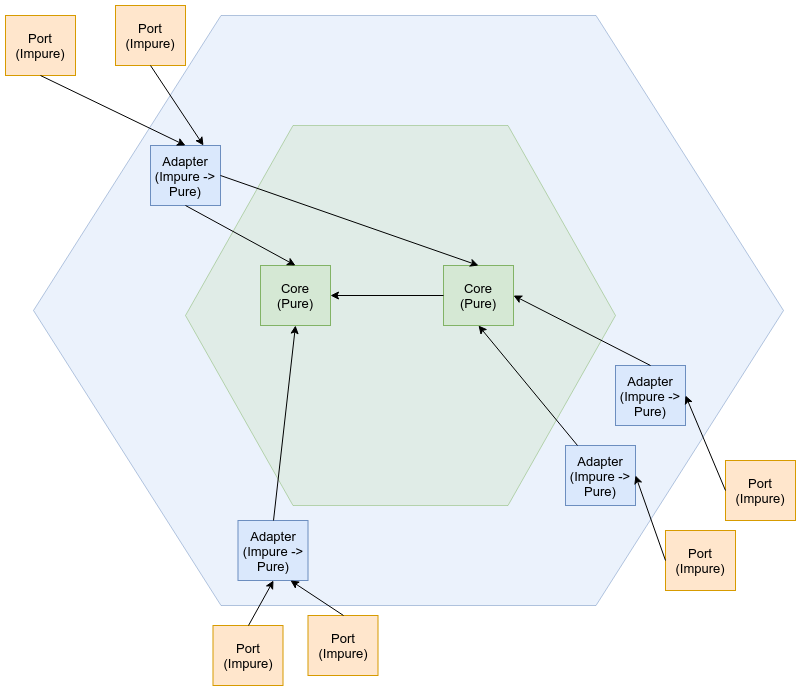

## Architektur für FP-Programme
- Funktionaler Kern, imperative Kruste
- gelegentlich aus Performance-Gründen: Imperativer Kern, funktionaler Mantel, imperative Kruste
- Seiteneffekte an die Ränder schieben 
- Entscheidungen und Effekte trennen
- konsequente funktionale Programmierung führt zu "Ports and Adapters"

---

## Ports and Adapters
