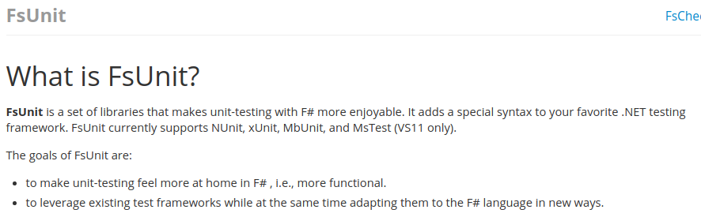
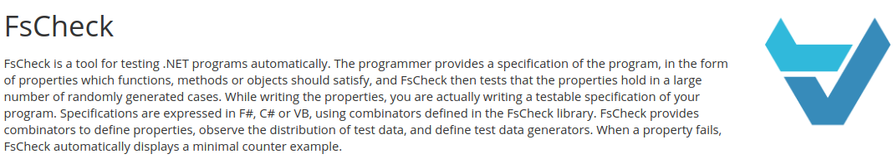
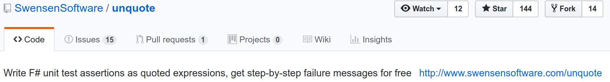
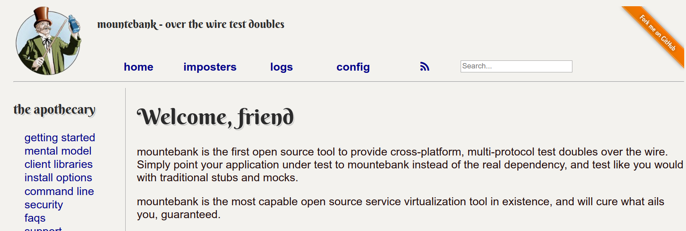
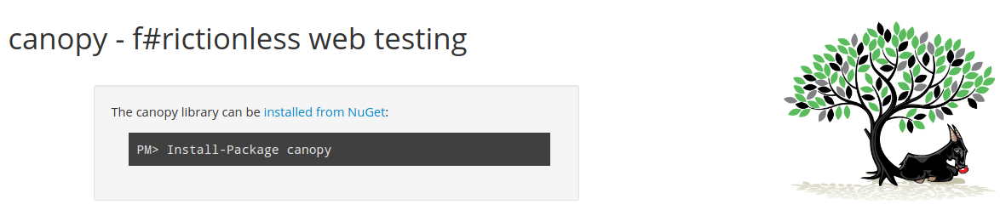
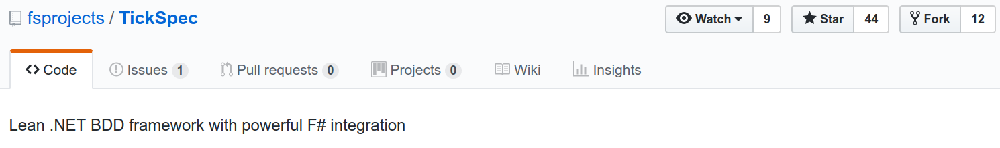
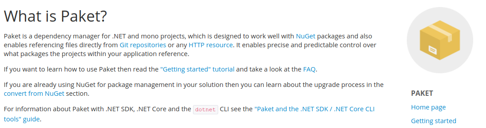
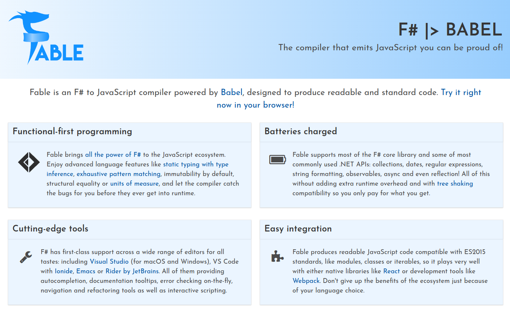
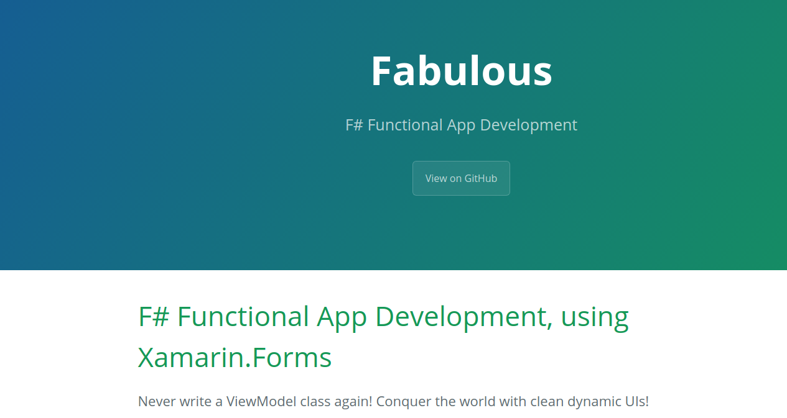
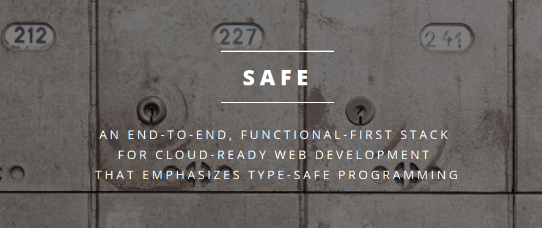

## F# in bestehendes Projekt integrieren
### Scripting zur Automation
- statisch typisierte Skripte
- .fsx Files
- kann C# mittlerweile auch

----

### Tests
- FsUnit für lesbarere Tests

----

- FsCheck für Property Based Testing

----

- Unquote für besseren "Callstack" bei fehlschlagenden Tests

----

- für Mocks: Object Expressions für direkte Interface-Implementierung, Foq, mountebank mit F# Binding
  

----

- Browser-Fernsteuerung mit canopy
  

----

- BDD-Tests mit TickSpec
  

----

### Builds
- FAKE als erweiterbare DSL für Build-Tasks
  
  
- Paket als Alternative zu Nuget
  
  
 
----

## Weitere Nutzungsmöglichkeiten
- Webseiten mit Fable
  

----

- Mobile Apps mit Fabulous
  

----

- Full-Stack-Webanwendungen mit dem SAFE-Stack
  
