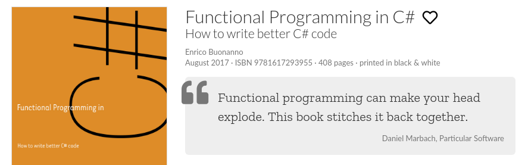
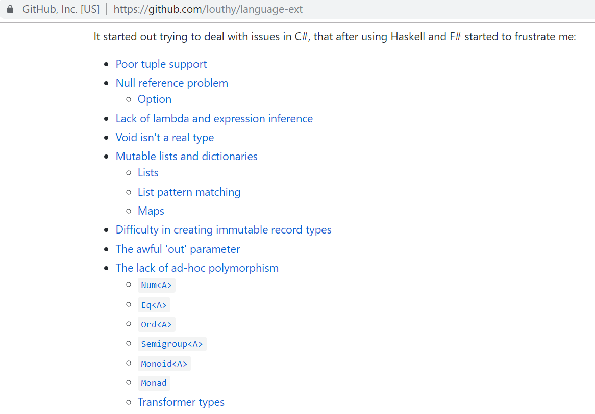
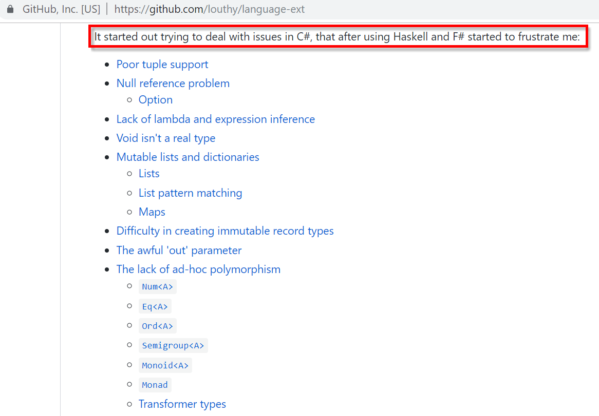
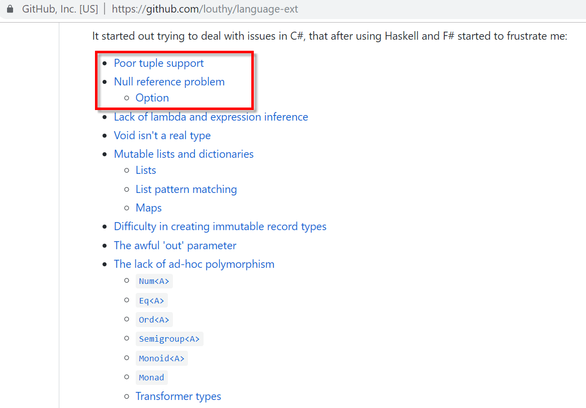
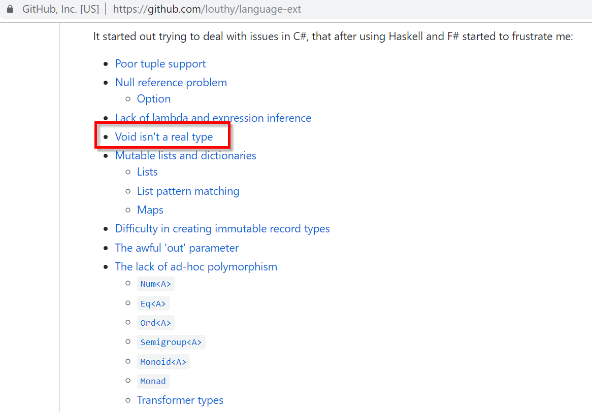
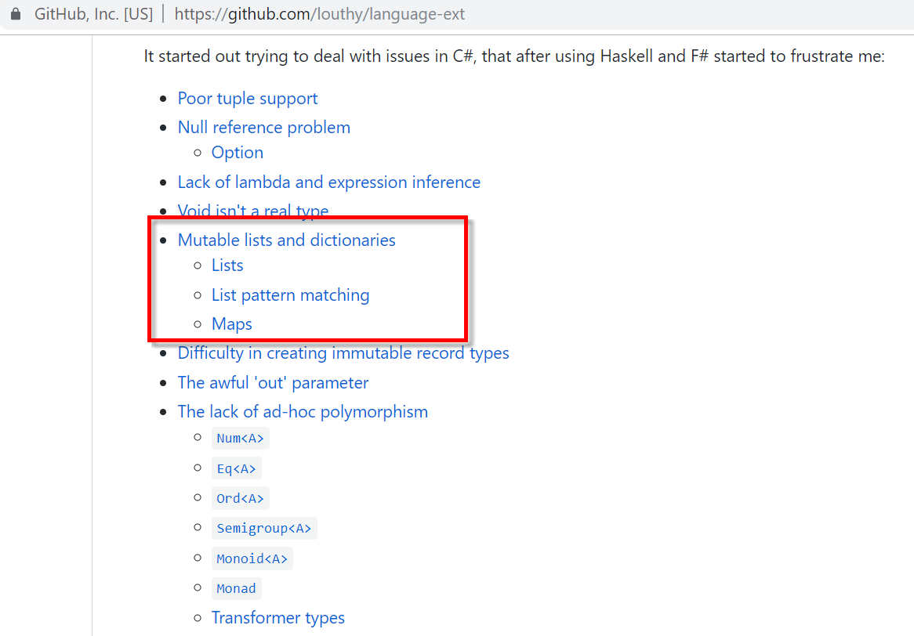
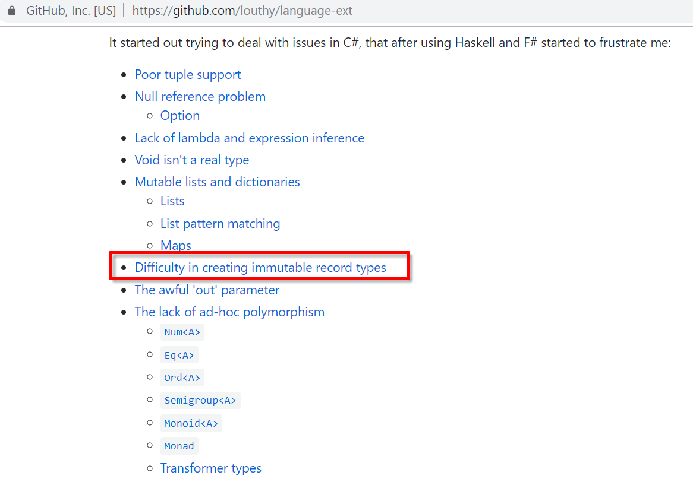

### LaYumba

----

### LaYumba

 <!-- .element: class="borderless" -->

----

### LaYumba

"einfache" Variante von [language-ext](https://github.com/louthy/language-ext)

----

 <!-- .element: class="borderless" -->

----

 <!-- .element: class="borderless" -->

----

 <!-- .element: class="borderless" -->

----

 <!-- .element: class="borderless" -->

----

 <!-- .element: class="borderless" -->

----

 <!-- .element: class="borderless" -->

----

### LaYumba

- NuGet Paket
- kann nicht alles
- Fokus: Didaktik (Ähnlichkeit mit F#, Haskell)

----

### LaYumba

alle C# Beispiele haben implizit...

```csharp
using LaYumba.Functional;           // <- lib
using static LaYumba.Functional.F;  // <- extensions
```
