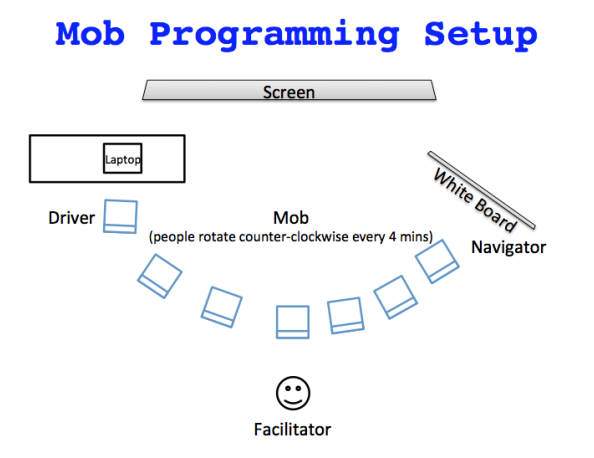

## Mob Programming

- wir lernen gemeinsam
- Pair Programming in der Gruppe

----

----

- Driver: Sitzt an der Tastatur (darf nicht denken)
- Navigator: Sagt dem Driver, was zu tun ist
- Mob: Unterstützt den Navigator
- Regelmäßiger Wechsel (3-5min)

----

### "Assisted" Mob Programming

- Facilitator unterstützt den Navigator
