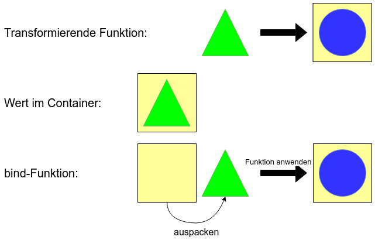

### Problem: Verkettung eingepackter Werte
```fsharp
let storeInDatabase path content = 
  try
    System.IO.File.WriteAllText(path, content)
    Some content
  with
    ex -> None

let stringToOption s =
    if String.IsNullOrWhiteSpace s then None else Some s

let toUpper (s : string) = s.ToUpper()

let nonEmptyStringStoreInPersistenceAndToUpper path content =
    let nonEmpty = stringToOption content
    // passt nicht: "string" erwartet, aber "string option" bekommen
    let stored = storeInDatabase path nonEmpty
    // passt nicht: "string option" erwartet, 
    // aber "string option option" bekommen
    let nonEmptyUpper = Option.map toUpper stored
```

----

### Monade ("Chainable")



----

### Monade ("Chainable")
- Container mit "bind" Funktion (die bestimmten Regeln folgt): "Chainable"
- Bezeichnung in der FP-Welt: **Monade**
- ```fsharp
  bind: (a -> M b) -> M a -> M b
```
- Andere Bezeichnungen für "bind": flatMap, SelectMany (LINQ), >>=

----

## Verkettung
```fsharp
let storeInDatabase path content = 
  try
    System.IO.File.WriteAllText(path, content)
    Some content
  with
    ex -> None

let stringToOption s =
    if String.IsNullOrWhiteSpace s then None else Some s

let toUpper (s : string) = s.ToUpper()

let nonEmptyStringStoreInPersistenceAndToUpper path content =
    let nonEmpty = stringToOption content
    let stored = Option.bind (storeInDatabase path) nonEmpty
    let nonEmptyUpper = Option.map toUpper stored
```

