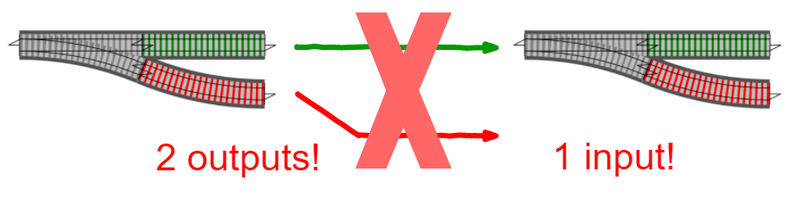
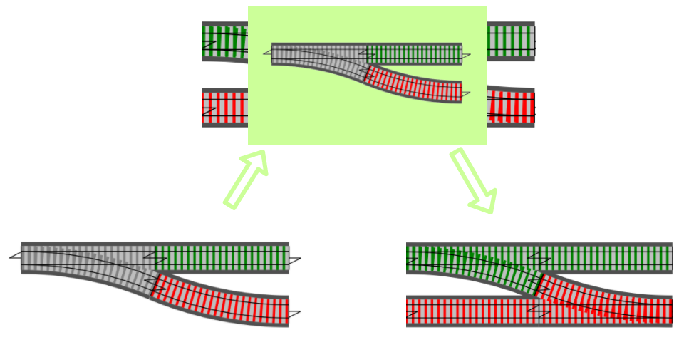

## Railway Oriented Programming

Funktionale Programmierung wird oft als das "Zusammenstöpseln" von Funktionen dargestellt...

----

Beispiel:

```
f1: Eingabe string, Ausgabe int
f2: Eingabe int, Ausgabe bool

FP: Komposition von f1 und f2
f3: Eingabe string, Ausgabe bool
```

```
// FP Syntax
f1: string -> int
f2: int -> bool
f3: string -> bool
```

----

```csharp
// Klassisch ===========================================================
int F1(string s) => int.TryParse(s, out var i) ? i : 0;
bool F2(int i) => i > 0;

// "verschachtelter" Aufruf
F2(F1("1")) // -> true
F2(F1("0")) // -> false

// "composition"
bool F3(string s) => F2(F1(s));
```

```csharp
// Method Chaining =====================================================
// mit C# extension methods
static int F1(this string s) => int.TryParse(s, out var i) ? i : 0;
static bool F2(this int i) => i > 0;

// Lesbarer (erst F1, dann F2)
"1".F1().F2() // ->true
"0".F1().F2() // ->false

// Lesbarer (erst F1, dann F2)
bool F3(string s) => s.F1().F2();
```

----

Problem: Keine standardisierte Strategie für Fehlerbehandlung 

----

- Wenn wir davon ausgehen, dass Funktionen auch einen Fehlerfall haben, benötigen wir einen **neuen Datentyp**, der das abbilden kann

----

#### Result/Either

- kann entweder 
  - das Ergebnis beinhalten, oder 
  - einen Fehlerfall

----

- In Railway-Sprech bedeutet dass, dass man "2-gleisig" fährt:

- Jede **Funktion** bekommt eine Eingabe, und 
  - hat "im Bauch" eine Weiche, die entscheidet ob 
    - auf das Fehlergleis oder 
    - auf das Erfolgsgleis umgeschaltet wird.

- Die Wrapperklasse mit der **Funktion** ist das Entscheidende!

----

- In anderen Worten: die Funktionen haben aktuell 1 Eingabe (1 Gleis), und 2 Ausgaben (2 Gleise)



----

- Man benötigt also einen Mechanismus, der eine 2-gleisige Eingabe so umwandelt, dass eine Funktion, die eine 1-gleisige Eingabe erwartet, damit umgehen kann



----

#### Was muss dieser Mechanismus können?

- wenn die Eingabe fehlerhaft ist, muss die Funktion nichts tun, und kann den Fehler weiterreichen
- wenn die Eingabe nicht fehlerhaft ist, wird der Wert an die Funktion gegeben

----


```haskell
bind: (string -> Result int) -> Result string -> Result int

bind: (a -> M b) -> M a -> M b
```

- FP-Jargon: eine Wrapper-Klasse, die `bind` bereitstellt, wird **Monade** genannt (sehr stark vereinfacht!).

Note:
Beispiel: siehe `ChainingOptions.Chaining_option_returning_functions`.


----

- `Either` besteht aus 2 Teilen
  - `Left`
  - `Right` ("richtig"...)
- `Result` besteht aus 2 Teilen
  - `Failure`
  - `Success`

----

- `Option` hat `Some(T)` und `None`

```csharp
Option<string> IsValidOpt(string s) =>
    string.IsNullOrEmpty(s)
        ? None
        : Some(s);
```

- `Either`/`Result` ist ähnlich zu `Option`
- `None` wird durch `Failure`/`Left` ersetzt (frei wählbar, z.B. selbst definierter Error Typ).

```csharp
Either<string, string> IsValidEither(string s)
    => string.IsNullOrEmpty(s)
        ? (Either<string, string>) Left("ups")
        : Right(s);
```

