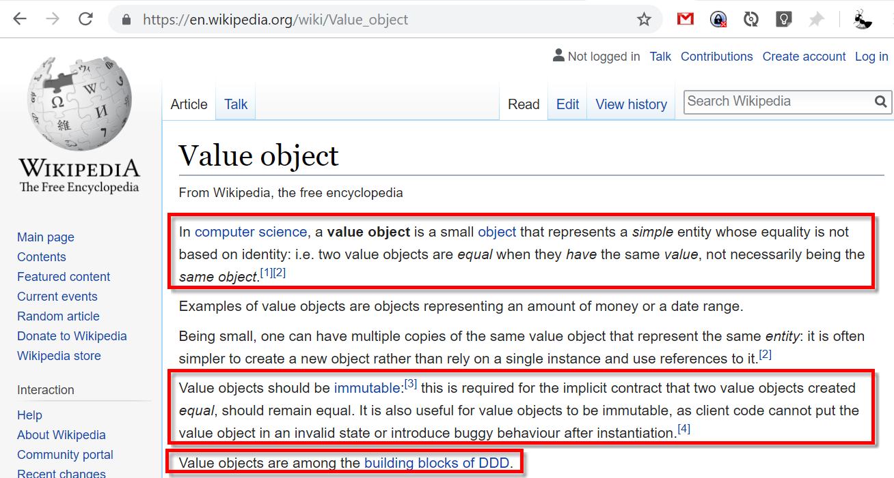

## Value Objects

Warum?

- Methoden sollten nicht lügen!
  - Null: NullPointerException, Null-Checks
  - Antipattern: Primitive Obsession

---

### Beispiele

```csharp
// :-(
void Einzahlen(int wert, SomeEnum waehrung) { /* ... */ }

// ;-)
void Einzahlen(Geld geld) { /* ... */ }
```

```csharp
class Kunde {
    int Alter { get; set; } // :-(
    
    // ist `i` das aktuelle Alter oder das Geburtsjahr??
    bool IstVolljaehrig(int i) { /* ... */}
}

class Kunde {
    Alter Alter { get; set; } // ;-)

    bool IstVolljaehrig(Alter alter) { /* ... */}

    bool IstVolljaehrig(Geburtsjahr geburtsjahr) { /* ... */}
}
```

---



---

## Value Objects

- nur gültige Objekte erlaubt
- immutable
- equality by structure

---

### Nur gültige Objekte

Es muss bei der Erstellung gewährleistet sein, dass das Objekt gültig ist.

---

### Nur gültige Objekte

Optionen:

- Konstruktor mit allen Parametern
- statische Hilfsmethode & privater Konstruktor

```csharp
class Geld 
{
    int Betrag { get; }
    Waehrung Waehrung { get; }

    Geld(int betrag, Waehrung waehrung) {
        if (!IsValid(betrag, Waehrung)) 
            throw new InvalidGeldException();

        Betrag = betrag;
        Waehrung = waehrung;
    }

    bool IsValid(int betrag, Waehrung waehrung)
        => betrag > 0 && waehrung != Waehrung.Undefined;
}
```

---

### Immutability

Damit ein C# Objekt unveränderlich wird, muss gewährleistet sein, dass es auch **nach Erstellung nicht verändert wird**.

- interne Werte dürfen ausschließlich vom Konstruktor verändert werden
- kein public oder private setter
- kein parameterloser Konstrukor

---

### Equality by structure

2 Objekte sind gleich, wenn sie die gleichen Werte haben.

---

### Exkurs: Vergleichbarkeit

- Equality by reference
- Equality by id
- Equality by structure

---

### Equality by structure

2 Objekte sind gleich, wenn sie die gleichen Werte haben.

- `Equals` und `GetHashcode` überschreiben

```csharp
override bool Equals(Geld other)
    => other.Betrag   == this.Betrag &&
       other.Waehrung == this.Waehrung;

override int GetHashCode() { /* ... */ }
```

